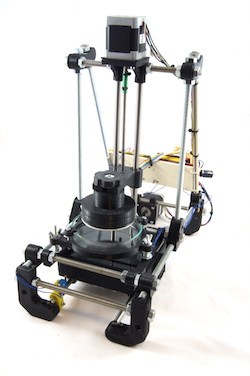

#Open Exposer

OpenExposer is a low cost open source stereolithography printer.

</img>
</img>

## Hardware

### 3D printed parts
For this early prototype you will need some 3d printed parts. All parts were made with OpenSCAD. They are located in the 3D parts folder.

### Electronics

#### Controller Board
The Open Exposer uses an Arduino UNO. There is no Arduino Shield until now. I am using the FabScan Shield for mounting the motor drivers until now. 

#### Polygon Mirror
Currently Open Exposer uses a Aficio 1018 G029-1961 (or compatibel with a NBC3111 driver ic) Polygon Mirror. It can be ordered from Aliexpress or Ebay. 
http://www.aliexpress.com/snapshot/303668242.html?orderId=60566587991552

#####Pinout: 

*	pin1: clock
*	Pin2: No connection.
*	pin3: Motor start/ stop: Gnd is start +5
*	Pin4: Motor Ground.
*	Pin5: Vmotor: 12V

For generating the clock signal, a attiny2313 is used. It will be replaced by a 555 soon.

#### Laser Driver
The laser unit uses a TTL laser driver. The laser driver Board is located in the electronics folder. It is based on the di4drive TTL laser driver.

## Software

### Slicing
In the first Step the STL files should be sliced with Sli3r to SVG files. Then the SVG file should be post processed by the Open Exposer slicer tool. This tool creates Open Exposer compatible g-code files.

### Host
The host application is a small python script which sends the g-code files line by line to the Open Exposer

### Firmware
Open Exposer Arduino Firmware. 

##Other use cases

* uv PCB exposing

##I'll keep you informed
*	<a href="http://twitter.com/l_k3">Twitter</a>
*	<a href="https://www.youtube.com/user/clustermaster23">Youtube</a>
*	<a href="https://www.facebook.com/pages/Mario-Lukas/714788148580621">Facebook</a>
*	<a href="http://www.mariolukas.de/?s=openexposer">Blog</a>
*	<a href="https://hackaday.io/project/1129-openexposer">hackday.io (Hackaday Prize Project 2014)</a>

